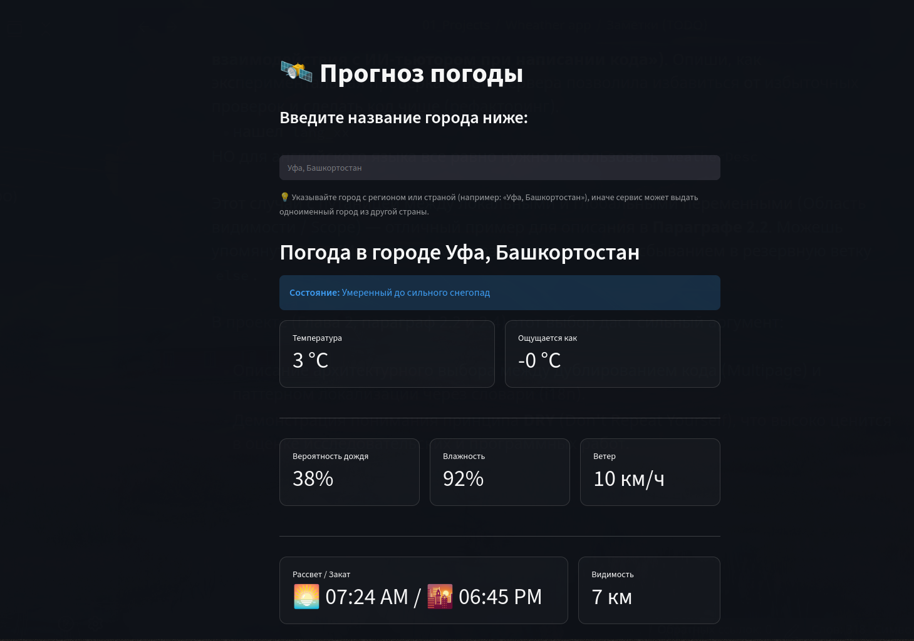
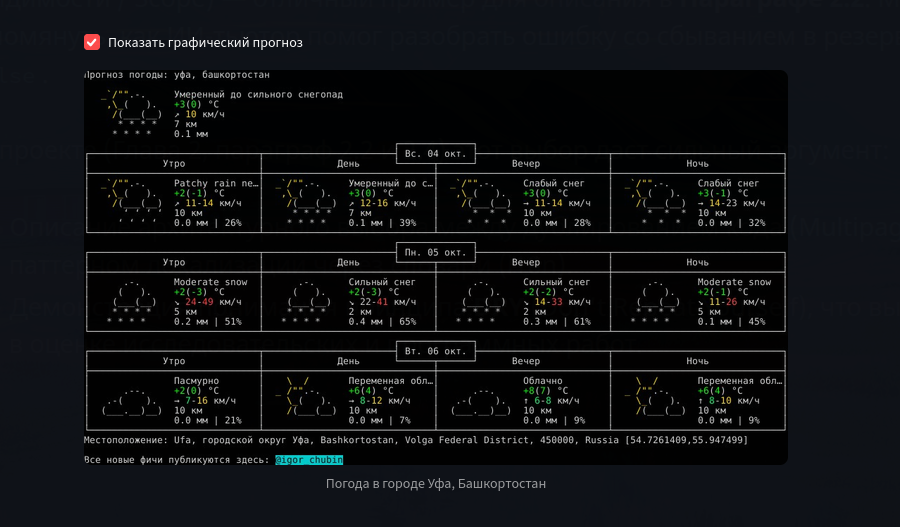

# 🛰️ Weather App — Web Application for Weather Forecasts

Интерактивное веб-приложение для просмотра актуального прогноза погоды и визуальных метеокарт, разработанное на **Python** с использованием фреймворка **Streamlit** и API **wttr.in**.

👉 **Онлайн-версия приложения:** [weather-app-102.streamlit.app](https://weather-app-102.streamlit.app/)

---

## 📸 Скриншоты интерфейса

  <h3>Главный экран и карточки метрик</h3>
  

    

  <h3>Графический прогноз погоды</h3>
  

---

## ✨ Ключевые возможности

- **Мультиязычность (i18n):** Поддержка русского, английского (English) и немецкого (Deutsch) языков.
- **Наглядная аналитика:** Вывод ключевых показателей (температура, «ощущается как», вероятность осадков, влажность, скорость ветра, видимость, а также время рассвета и заката в единой метрике).
- **Визуальные карты:** Загрузка и отображение графического PNG-прогноза по требованию.
- **Оптимизация и кэширование:** Использование `@st.cache_data` (TTL = 15 минут) для снижения нагрузки на внешнее API и мгновенной повторной загрузки.
- **Отказоустойчивость:** Обработка ошибок сети, таймаутов, несуществующих городов и резервное переключение ключей локализации API.

---

## 🛠️ Технологический стек

- **Язык программирования:** Python
- **Фреймворк интерфейса:** Streamlit
- **Запросы к API:** Requests
- **Источник данных:** [wttr.in](https://wttr.in) (JSON API + PNG rendering)
